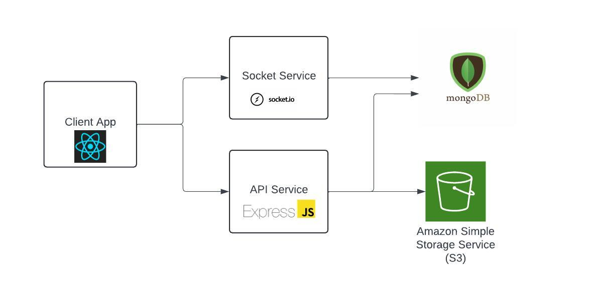

# NodeJS API for social app application

## A NodeJS application which is based on <a href="https://expressjs.com/">Express</a> framework to provide API endpoints for small social network application
This project is the backend of a small social network application. Some main features that I have developed are:
* Sign up, sign in, update user profile information
* Create/ Comment / reaction to posts with realtime notification
* News feed
* Friend request/accept/ignore/cancel flow
* realtime chat between friends

### Demo link: https://social.manhnd.men

## Architecture
The diagram below show overview architecture of the entire system



Reference:
* Client app repo: https://github.com/manhnd9293/social-app-ui
* Socket repo: https://github.com/manhnd9293/social-app-socket

## How to install this project on local machine

Follow below steps to install this project on local machine:

1. Install NodeJS version 18.0 or later
2. Clone this project
3. Run command ```yarn install``` to install all project's dependencies

## How to Run the app
Before starting the application, you need to set up and running following components:
1. Mongodb database and credential data to access it
2. AWS S3 bucket and an IAM user with read and write permission to that bucket and its access key

Follow below steps to run the app locally
1. Provide file .env with information as in file .env.example in root folder of this repository
2. Run one of following commands: ```yarn dev```

## Stay in touch
* Author - [Manh Nguyen](https://github.com/manhnd9293)

